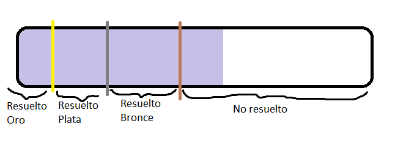
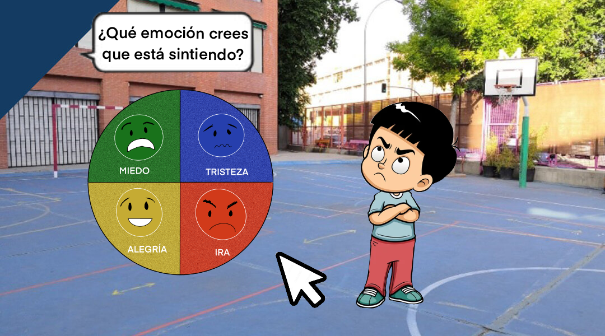
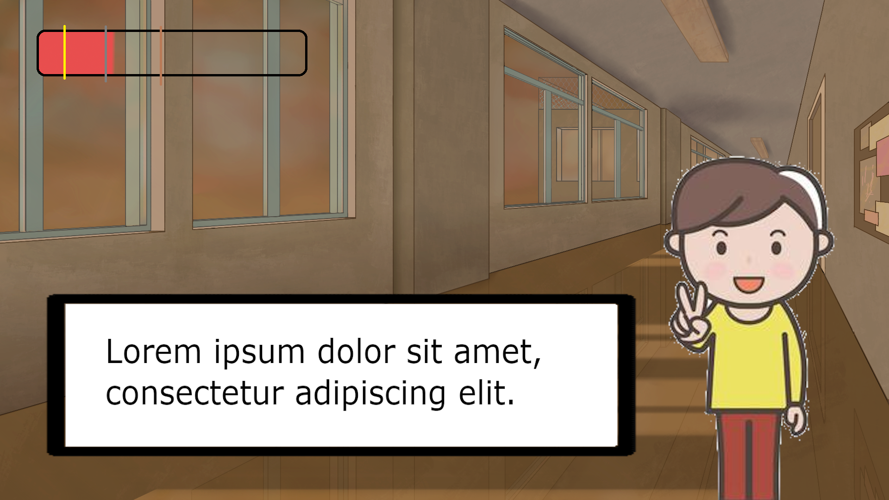
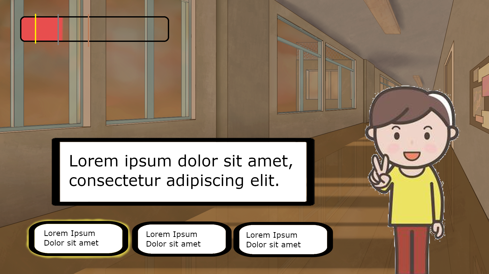

# GDD - Mediando por todos

# Datos Generales

## Concepto de Juego

En el juego encarnas a una persona preadolescente que ha de aprender a gestionar y resolver conflictos a través de la identificación de emociones y estrategias. 

## Género

Narrativa divergente en 1ª persona en 2D.

## Audiencia Objetivo

Jóvenes de 10 a 12 años.

## Objetivo Pedagógico

Se pretende que los preadolescentes, a los que va dirigido el juego, aprendan a reconocer emociones en ellos mismos y en los demás para gestionar adecuadamente ciertos conflictos que suceden en el ambiente escolar. 

## Contexto de Uso

El juego se va a desarrollar para ser utilizado en un contexto educativo. Se plantea como complemento a las charlas de mediación, con el objetivo de que los alumnos aprendan a manejar y actuar frente a conflictos que se dan comúnmente en el ámbito educativo.

Se utilizará en aulas con soporte informático y auriculares. Las sesiones de uso pueden llegar a durar 50 minutos.

# Mecánicas

El juego tiene dos partes diferenciadas en las que las mecánicas son diferentes:

- Día a día:
    - Avanzar diálogos: Se podrá ir avanzando por los distintos diálogos con el click izquierdo del ratón.
    - Seleccionar respuestas: Al ir avanzando en los diálogos de vez en cuando se dará la opción de escoger entre varias respuestas que podrán tener un efecto en la dirección de la conversación.
    - Movimiento entre escenas: El jugador podrá avanzar a escenas futuras de un conflicto a través de las interacciones.
- Conflictos:
    - Medidor de tensión: Dependiendo del estado del conflicto aumentará o disminuirá, indicando la tensión general de la situación.
    - Selector de actores en el conflicto: Al iniciar un conflicto se podrá escoger con quien interactuar de forma inicial.
    - Selector de emociones: Al escoger al integrante del conflicto inicialmente se pedirá al jugador identificar la emoción de la persona con la que están conversando.  Habrá 4 emociones principales a identificar que usarán iconos sencillos:
        - Alegría
        - Enfado
        - Tristeza
        - Miedo
    - Interactuar con uno de los actores: Dependiendo de si el jugador acierta o no subirá o bajará la tensión de forma acorde y obtendrá feedback del actor. Después se conversará de forma normal, dando elecciones al jugador que afectarán al medidor de tensión dependiendo de lo acertadas que sean.

# Dinámicas

## Bucle de Juego

El juego se divide en niveles que son representativos de los distintos conflictos. 

Los conflictos tienen la siguiente estructura:

- Entras en la escena y podrás interactuar con algunos de los personajes.
- A medida que completes las interacciones se irán desbloqueando los otros personajes.
- Una vez se ha interactuado con todos los personajes principales del conflicto terminará el nivel.

Cada una de estas interacciones funciona así:

- Primero se identificará la emoción que está sintiendo cada personaje. Aquí empezaría la interacción.
- A través de esa elección, y de cómo avance la conversación, el medidor de tensión irá subiendo o bajando. La función del medidor es dar feedback al jugador sobre las decisiones que ha tomado.
- Una vez terminada la interacción con uno de los personajes implicados no se podrá volver a hablar con este personaje.
- El conflicto siempre finalizará. Todos los conflictos tendrán cuatro estados una vez terminados: No Resuelto, Resuelto (Bronce), Resuelto (Plata) y Resuelto (Oro).

Una vez has interactuado con todos la situación tendrá una resolución dependiendo del nivel del medidor de tensión.

También, dependiendo de si se ha resuelto el conflicto y cuán bien se haya hecho el jugador podrá ganar medallas de bronce, plata u oro como recompensa.

## Niveles

Cada nivel del juego es representativo de uno de los conflictos más comunes, aquí se presentan ordenados por día de aparición:

- Problemas de espacio: (Tutorial):
    - Precedente: Se escuchará como dos personas discuten en base a os problemas de espacio en el recreo, Elena y Héctor.
    - Conflicto: El mediador está en el recreo cuando observa dos grupos de personas discutiendo. Habría tres opciones de intervención:
        - Hablar con alguien que no ha tenido que ver en el conflicto: Será un personaje neutral que conoce la situación. Hablaría del conflicto general que se produce entre las personas que juegan al fútbol y las que no, sin posicionarse en ningún lado.
        - Hablar con la persona que quiere jugar al fútbol: Será una persona  que representará al grupo de los que juegan al fútbol.
        - Hablar con la persona que ha pegado el balonazo: Defenderá los intereses de las personas que no juegan al fútbol.
        
    
    En función de si se ha seguido el procedimiento correctamente o no el conflicto tendrá los siguientes posibles resultados:
    
    - **Bronce:** Elena se ha disculpado, pero Héctor no, solo Elena está contenta con la resolución del profesor.
    - **Plata:** Elena se ha disculpado, pero Héctor no, ambos están contentos con la resolución del profesor.
    - **Oro:** Las dos partes del conflicto han entendido qué han hecho mal y por qué ha hecho cada uno lo que ha hecho. Se perdonan y vuelven a estar cómodamente juntos.
- Se agreden física y verbalmente:
    - Precedente: Se podrá ver como dos personas empiezan a insultar gravemente.
    - Conflicto: El jugador se encontrará con las personas que antes habían empezado a enemistarse, esta vez insultándose. Para empezar la mediación se interactuará directamente con las personas implicadas en el conflicto, este conflicto sirve de tutorial, de modo que hay un personaje auxiliar ayudándote.
    - Resolución: El jugador tendrá que pedir a los implicados que expliquen lo que ha pasado y que lo hagan uno a uno. El jugador escogerá con quién quiere interactuar primero y guiará a la persona a que explique lo que ha pasado con calma, sin insultar y mostrando cómo se ha sentido con lo ocurrido. Se tendrá que escuchar sin juzgar ni tomar partido, una vez recibida la información se intentará devolver la misma para preguntar por una confirmación. Una vez terminada la interacción con uno de los actores se repetirá el proceso con el otro. Con toda la información se buscará consensuadamente una resolución al conflicto. Además en caso de insultos o de provocaciones previas se buscará que se disculpen y admita cada implicado su parte de culpa.
        
        En función de si se ha seguido el procedimiento correctamente o no el conflicto tendrá los siguientes posibles resultados:
        
        - **Fallo:** El conflicto no se ha detenido, ha seguido escalando hasta el punto de pegarse y se ha tenido que avisar al adulto más cercano.
        - **Bronce:** El conflicto se ha detenido, pero ninguna de las partes está a gusto con la otra inmediatamente tras lo ocurrido y se darán espacio tanto temporal como físicamente.
        - **Plata:** Ambas partes se han perdonado por lo ocurrido y ya no sienten tensión con el otro, aunque puede que se dejen un tiempo o que no hayan entendido del todo su responsabilidad.
        - **Oro:** Las dos partes del conflicto han entendido qué han hecho mal y por qué ha hecho cada uno lo que ha hecho. Se perdonan y vuelven a estar cómodamente juntos.
- Balonazos
    - Resolución: En primera instancia se debe conseguir que la persona que pega el balonazo se disculpe. Después de lograr esto se debe dialogar que ambas partes para buscar una solución. Hay que predisponer al que a recibido al balonazo a aceptar que el que le ha dado el balonazo se disculpe con él, bajar la tensión del que ha dado el balonazo y tratar de que empatice con él que ha recibido el balonazo.
        - **Medallas en función de la resolución del conflicto:**
            - **Fallo:** No se llega a ninguna resolución y las dos partes no se hablan.
            - **Bronce:** El que ha dado el balonazo se disculpa para salir del paso y el que lo ha recibido no las acepta.
            - **Plata:** Se piden disculpas, pero el que ha dado el balonazo lo hace solo para salir del paso.
            - **Oro:**  El que ha recibido el balonazo y el que lo ha dado se reconcilian y se piden perdón.
- Se excluyen:
    - Precedente: Puedes escuchar el final de una conversación entre las dos chicas protagonistas del conflicto. En ella escuchas que una no quiere saber nada de la otra.
    - Conflicto: Encuentras a la chica llorando en el patio rodeada de un grupo grande de personas. Al acercarte puedes elegir si hablar directamente con la chica o hablar con alguna de las personas que han observado el conflicto. Habrá 3 opciones:
        - Hablar con alguien que no ha tenido que ver en el conflicto: Es un personaje que no has visto antes y está junto a más personas, al conversar con esta persona te cuenta que ha visto como la chica estaba discutiendo con otra y que esta se ha puesto a llorar. Puedes intentar que ayude de forma activa yéndose junto a su grupo para dar espacio a la chica.
        - Hablar con alguien que tiene más información del conflicto: Has visto a este personaje consolando a la chica anteriormente en la parte de precedente. Te da información sobre el conflicto de forma más profunda pero también más sesgada, ya que la chica que está llorando es su amiga se pondrá de su parte al relatar lo sucedido.
        - Hablar con la chica que está llorando: Inicialmente hay que conseguir que se calme para poder comunicarse con ella de forma más efectiva. Una vez conseguido te dará su parte del conflicto. Al hablar con ella será necesario intentar situarla en una posición en la que esté dispuesta a perdonar al grupo que la ha excluido para ser lo más efectivos posibles en la resolución.
        
        Después de haber interactuado con la chica se llegará a la conclusión que lo mejor es hablar con la otra parte del conflicto y se llevará al jugador a hablar con la parte que ha decidido excluir a la chica.
        
        Al hablar con esta otra parte descubriremos su perspectiva de la situación y le hablaremos de la perspectiva de la otra persona. Dependiendo de lo bien que se haya conseguido resolver el conflicto las medallas corresponderán en esto caso a:
        
        - Fallo: No se ha resuelto el conflicto, la chica que has encontrado llorando continúa mal y el grupo en el que estaba continúan ignorándola.
        - Bronce: Se perdonan pero ya no están tan bien entre ellas, así que se dan un espacio. La chica que estaba llorando encuentra otro grupo distinto con el que estar.
        - Plata: Vuelven a llevarse bien, pero el origen del conflicto no se ha tratado de forma apropiada. El grupo de la chica le da otra oportunidad pero es posible que la situación se repita en un futuro.
        - Oro: Vuelven a llevarse bien y cada miembro se da cuenta de las cosas que ha hecho mal. El origen del problema ha sido tratado por cada parte de forma profunda y es poco probable que se repita.

## Limitaciones debido al Uso Pedagógico

Tendrá una duración de un máximo de 50 minutos, por el límite de tiempo de clase.

El lenguaje tiene que ser fácilmente entendible para alguien de entre 10 y 12 años y estar adecuado a sus formas de hablar.

Por temática del juego se podrían abordar temas más sensibles como el bullying pero no se hará para ceñirse al programa e ideas principales que se nos han proporcionado.

# Estética

## Historia

Vives tu día a día en el colegio y formas parte del programa de mediación, tienes que lidiar con los conflictos de los nuevos alumnos de 1º y 2º. Serán un total de 1 conflicto tutorial y 3 conflictos principales, que se centrarán alrededor de un tema principal de confrontación en esas etapas solicitado por el cliente.

## Visual

La estética del juego es visual y realista para garantizar la comprensión e inmersión en la historia en todo momento. El juego está representado en 2D, con dibujos sencillos, adecuados para el público al que va dirigido.

## UI

El menú principal tendrá varias opciones sencillas.

- Jugar: Abrirá un nuevo menú en el que escoger los niveles desbloqueados para avanzar o jugarlos de nuevo. Aquellos que no se hayan desbloqueado aparecerán desaturados y no se podrán seleccionar. Los ya completados aparecerán con el rango de compleción máxima conseguido; oro, plata, bronce o no conseguido; y se podrán seleccionar.
- Opciones: Abrirá un nuevo menú de ajustes
- Salir: Cerrará el juego

Durante el juego los elementos de la UI más significativos serán:

- Medidor de tensión: La barra subirá o bajará en función de como de cerca esté el jugador de resolver el conflicto. Además, indicará si se ha conseguido resolver de una forma más o menos adecuada (oro, plata y bronce respectivamente).

- Cuadro de emociones: El jugador debe seleccionar la emoción que cree que siente el personaje indicado en cada momento. En función de su elección se mostrarán unos diálogos u otros.

- Cuadro de diálogo: Al hablar con los personajes se mostrará el texto de forma progresiva en letras negras sobre un recuadro de fondo blanco en la parte inferior de la pantalla.
- Selector de respuestas: Al interactuar con los cuadros de diálogo en ocasiones será necesario responder. Para ello el cuadro de diálogo desaparecerá y las distintas opciones se dispondrán de izquierda a derecha en recuadros con letras negras y fondo blanco en la parte inferior de la pantalla. Al pasar el ratón por encima se resaltará la selección modificando los bordes.

El menú de ajustes tendrá:

- Botón de volver: permitirá volver a la pantalla desde la que se abierto el menú.
- Slider de volumen: controla el volumen general del juego.
- Slider de efectos de sonido: controla el volumen de los efectos de sonido dentro del juego.
- Slider de música: controla el volumen de la música del juego.

El menú de selector de niveles mostrará los niveles (conflictos) del juego. Sobre cada nivel aparecerá el estado en el que se encuentran (No superado, Bronce, Plata u Oro). Para jugar un conflicto desde el selector de niveles será necesario haberlo desbloqueado, es decir, el jugador debe de haber completado el conflicto anterior, menos en el caso del primer nivel; hasta que no sea así aparecerán bloqueados. 

## Mockups

Selección de Emociones:

Conversación y Selección de Respuesta:

Selección de personaje con el que se va a interactuar

## Uso de IA

No se han usado herramientas de IA.